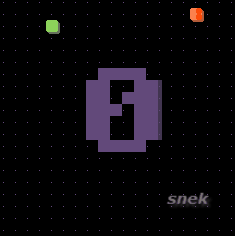

# Snek

One tiny snake game demo using **LovyanGFX** SDL simulator. Decoupling the **Render Engine**, **Keyboard Input** and **GameState**.

> Thanks for [Forairaaaaa](https://github.com/Forairaaaaa) provided support.

<div class="snek" align="center">
  <table>
    <tr>
      <td>
      <td>
      <td>
    </tr>
    <tr>
      <td align="center"><font size="2" color="#999"><u>Snek Game Demo</u></font></td>
      <td align="center"><font size="2" color="#999"><u>Snek Game Start</u></font></td>
      <td align="center"><font size="2" color="#999"><u>Snek Game Over</u></font></td>
    </tr>
  </table>
</div>

## Prerequisite

- Ubuntu 20.04 or higher
- CMake
- Clang or GNU build toolchain
- SDL2

```bash
sudo apt-get update
sudo apt-get install -y build-essential libsdl2-dev
```

## Usage

```bash
git clone https://github.com/HangX-Ma/snek.git
cd snek && git submodule init --update --recursive
cmake -B build
cmake --build build -j$(nproc)
# run the game!
./build/snek
```

Control the snek movement using arrow key &uarr;, &darr; &larr; and &rarr;. Restart the game by pressing and holding down on &rarr;.

## License

MIT License
