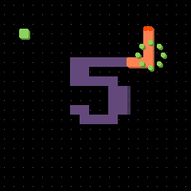
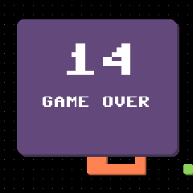

# Snek

One tiny snake game demo using **LovyanGFX** SDL simulator. Decoupling the **Render Engine**, **Keyboard Input** and **GameState**.

> Thanks for [Forairaaaaa](https://github.com/Forairaaaaa) provided support.

<style>
img {
    margin: 40px 0 0 40px;
    box-shadow: 0 0 0 15px #fff;
}
</style>

<div align="center">
    
    
</div>

## Prerequisite

- Ubuntu 20.04 or higher
- CMake
- Clang or GNU build toolchain
- SDL2

```bash
sudo apt-get update
sudo apt-get install -y build-essential libsdl2-dev
```

## Usage

```bash
git clone https://github.com/HangX-Ma/snek.git
cd snek && git submodule init --update --recursive
cmake -B build
cmake --build build -j$(nproc)
# run the game!
./build/snek
```

## License

MIT License
